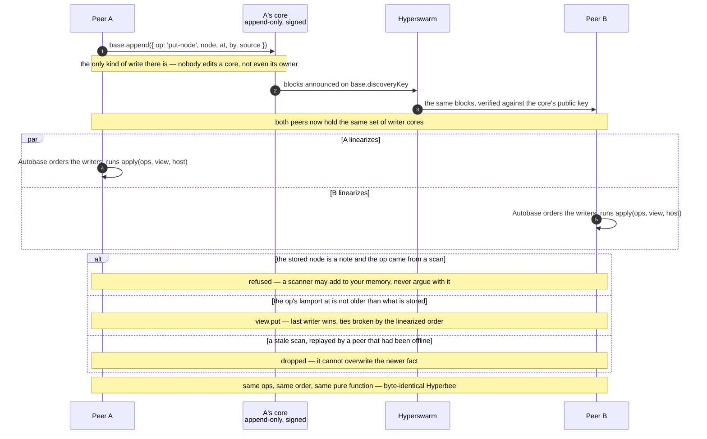
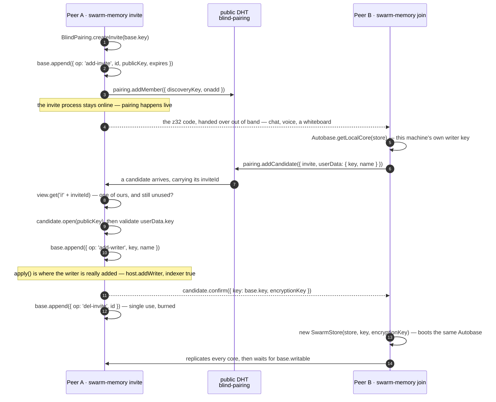
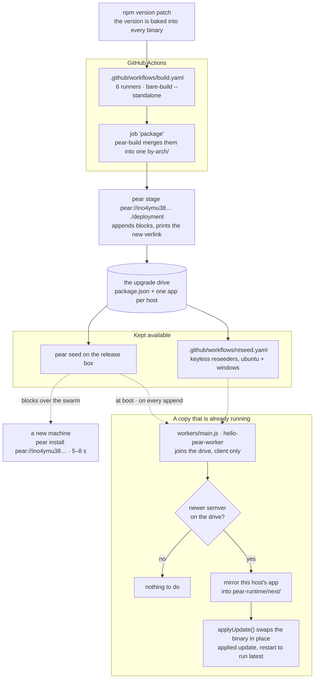
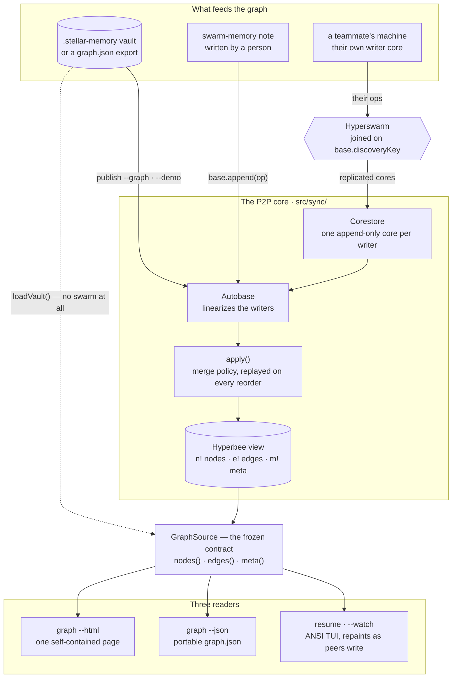
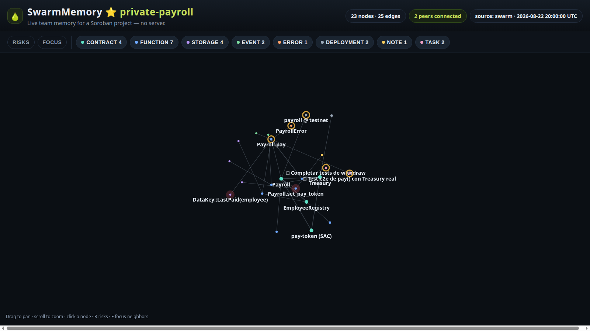

# SwarmMemory

**A smart-contract project's memory, shared between your team's peers with no server — installed and
updated peer-to-peer through Pear.**

Aleph Hackathon 2026 · Pears Track

What a contract project actually knows — which contract calls which, where the TTL and auth risks
are, what drifted on-chain, the note someone wrote at 3 AM — lives in people's heads and in silos.
Every new person on the team pays for that again. SwarmMemory keeps it as a knowledge graph that
every peer writes to and every peer holds a full copy of.

```sh
pear install pear://ino4ymu381ouhyo14u6sg5ursbto4irt4n5mhhzjkk8a7mwgd6iy
```

That is the whole installation: Pear fetches the binary for your platform from peers and puts
`swarm-memory` on your PATH. Measured at 5–8 seconds on clean GitHub-hosted Windows runners. No
Node.js on the user's machine. If you don't have the Pear CLI yet, `npm i -g pear`.

```
$ swarm-memory publish --demo
published 23 nodes, 25 edges into yfotqmj336et7zmbpmxu7oc8hj4tcyzwmo3b16mw3utfgpayf9wo

$ swarm-memory note "LastPaid has no extend_ttl - a payment can become unreachable" \
    --about storage/payroll.lastpaid
noted note/lastpaid-has-no-extend-ttl-a-payment-can-b-24 → storage/payroll.lastpaid

$ swarm-memory resume

private-payroll
24 nodes  ·  26 edges  ·  0 peers  ·  writer
yfotqmj336et7zmbpmxu7oc8hj4tcyzwmo3b16mw3utfgpayf9wo

Contracts
  EmployeeRegistry  4 fn   testnet
  pay-token (SAC)          external
  Payroll           4 fn   testnet    drift
  Treasury          4 fn   testnet

On-chain
  payroll @ testnet   out of sync with local source
  treasury @ testnet  in sync

Worth knowing
  !!  Payroll.set_pay_token
      Changes the payment token. Mutates state and never calls require_auth.
  !!  DataKey::LastPaid(employee)
      Persistent key with no extend_ttl: it can expire and become unreachable — a
      Soroban-only footgun.
   !  PayrollError
      5 variants whose discriminants are published ABI — renumbering one breaks clients
      without breaking the build.
   !  Payroll.pay
      Pays an employee from Treasury. Missing an end-to-end test against a real
      Treasury.

Notes    written by people, never overwritten by a scan
  LastPaid has no extend_ttl - a payment can beco…            Zephy_2
      LastPaid has no extend_ttl - a payment can become unreachable
  Decision: configurable pay token                            Zephy_2
      Human note: we chose an admin-configurable token instead of hardcoding the SAC, so
      a testnet asset swap does not need a redeploy.

Open tasks
  □ End-to-end test for pay() with a real Treasury  payroll/src/test.rs:23
  □ Finish the withdraw tests                       README.md:24

  7 functions  ·  4 storage keys  ·  2 events  ·  1 error
  swarm-memory graph --html map.html   for the whole picture
```

Real output, colours stripped. Every function, storage key and event is in the graph; the view

## Why this is not a shared markdown file

A document in a repo has one writer at a time, needs a host, and goes stale silently. The mechanisms
here are different ones:

- **Every peer is a writer.** Each machine appends to its own Hypercore. Nobody has to be online for
  you to write, and there is no primary copy to lose.
- **Autobase linearizes the writers into one view.** The cores are merged into a single
  deterministic order and folded into a Hyperbee. Two peers with the same set of cores compute
  byte-identical state — the merge is a pure function, not a sync conflict dialog.
- **No server, no account, no config.** Pairing is one invite code over the public DHT
  (`blind-pairing`); Hyperswarm finds the peers. There is nothing to deploy and no login.
- **The binary is evergreen.** It watches its own `pear://` link and applies new releases over the
  same swarm it uses for data. Nobody re-installs anything.

### The merge policy is the product opinion

`src/sync/apply.js` is 163 lines and one rule: **machines may refresh facts, they may not erase what
a person decided to say.**

- Automatic writes are last-writer-wins by a lamport stamp `at`, so a stale scan replayed from a
  peer that was offline loses to a newer one instead of overwriting it.
- A node of type `note` — the human half — is never overwritten or deleted by a write with
  `source: 'scan'`. A scanner can add to your memory; it cannot argue with you.

That is enforced inside `apply()`, which Autobase re-runs whenever the linearized order changes, so
the rule survives reordering and cannot be bypassed by writing directly to the view.



Every branch above runs on both machines, from the same input. That is the difference between this
and a shared file: there is no moment where two versions exist and something has to choose.

## The commands

|                                                |                                                                      |
| ---------------------------------------------- | -------------------------------------------------------------------- |
| `swarm-memory`                                 | the project's context, then stays open and repaints as peers write   |
| `swarm-memory resume`                          | print it once and exit                                               |
| `swarm-memory resume --watch`                  | the live view — a teammate's note lands here with nothing to refresh |
| `swarm-memory note "…" [--about <id>]`         | write something the team should remember                             |
| `swarm-memory publish --demo`                  | load the bundled demo project                                        |
| `swarm-memory publish --vault <dir>`           | load a scanned `.stellar-memory` project into the swarm              |
| `swarm-memory resume --vault <dir>`            | read a scanned project off disk, without the swarm                   |
| `swarm-memory invite` / `join <code>`          | pair a teammate, no server and no account                            |
| `swarm-memory peers`                           | connections, writer status, graph size                               |
| `swarm-memory graph --html <f>` / `--json <f>` | the offline viewer, or a portable export                             |
| `swarm-memory status`                          | version, storage, update channel                                     |

## Two peers, one code

```
$ swarm-memory invite                       # terminal A — stays online while they join

  Invite code (single use)
  yryzpzc4zwg5i4ds1gzn7bpw7s17dge6ubypj3dxzbinwie6cr48ehx3behgcq6q4jxdaya787…

  Your teammate runs:
    swarm-memory join yryzpzc4zwg5i4ds1gzn7bpw7s17dge6ubypj3dxzbinwie6cr48ehx…

  Keep this process running until they join — pairing happens live.

$ swarm-memory join yryzpzc4…               # terminal B, another machine, another network
pairing…
joined 1c1c8gqazno9m5tem39tmkr5c3kr964h8t1f1jrw3q1gy75qq1by — 23 nodes replicated
```

Measured over the public DHT: 23 nodes / 25 edges on peer B, four seconds after the code was pasted.
`swarm-memory peers` reports connections, writer status and graph size.



Nothing here is a server, an account or a config file. The code carries the invite; the base key and
the encryption key come back over the pairing channel only after A has checked the candidate.

## It updates itself

Leave `swarm-memory` running, publish a release, and the installed copy does the rest. A running
**v0.1.5** picked up **v0.1.7** with no user action:

```
Updates: enabled
[updater] getting new update
[updater] update complete... applying
[updater] applied update, restart to run latest version

$ swarm-memory --version
swarm-memory v0.1.7
```

Released version is **0.1.10**, six platforms in one 474 MB drive, verlink
`pear://0.29.ino4ymu38…`. Release procedure, deploy log and the staging quirks are in
[`docs/DEPLOY.md`](docs/DEPLOY.md); keeping the link available is [`docs/SEEDER.md`](docs/SEEDER.md).



The link never changes — only the drive's length grows. An installed copy compares **semver**, not
length, which is why a release that forgets `npm version` reaches nobody.

## Template: `hello-pear-bare`, branch `main`

We started from [`holepunchto/hello-pear-bare`](https://github.com/holepunchto/hello-pear-bare/tree/main),
branch **`main`** — the variant that runs the OTA updater (`pear-runtime`) inside a **Bare worker
thread**. That process shape is the reason we chose it: SwarmMemory is a long-lived TUI holding
swarm connections open, so update checks download in the worker while the main thread keeps
replicating and drawing. The single-threaded variant would have the terminal stall on the updater.

`app.js`, `workers/main.js` and the `upgrade` field of `package.json` are the template's updater and
are deliberately **untouched** — a `PreToolUse` hook (`.claude/hooks/guard-updater.js`) enforces it.

## Architecture

```
bin.mjs                     CLI entrypoint — paparam, one command per verb
app.js + workers/main.js    OTA updater from the template — untouched

src/sync/                   the P2P layer
  store.js       292  SwarmStore: Corestore + Autobase (view = Hyperbee) + Hyperswarm
  commands.js    255  resume · publish · invite · join · peers · graph
  apply.js       163  the merge policy — deterministic, replay-safe
  pairer.js      148  join by invite code (blind-pairing candidate side)
  colors.js       16  four ANSI escapes, because picocolors cannot run here

src/vault/       529  read a .stellar-memory vault into the frozen graph contract
src/core/        133  the in-memory graph model — pure JS, no I/O
src/render/      195  ansi.js paints the TUI · html.js injects the viewer
web/template.html     the self-contained HTML viewer
```

Both the local vault and the P2P view implement one frozen interface — `{ nodes(), edges(), meta() }`
— so `resume` and `graph` do not know or care which one they are reading.



The dotted edge is the reason the interface was frozen first: a vault read straight off disk and a
view computed from four peers' cores are the same thing to everything downstream of them.

The Hyperbee view is laid out as:

```
n!<id>                   a node   (contract, function, storage, event, error, deployment, note, task)
e!<from>!<type>!<to>      an edge  (calls, reads, emits, raises, notes, deployed_as)
m!<key>                  project metadata
```

Keys are ordered, so a node lookup is a `get` and "all edges out of X" is one range read.

### The viewer

`swarm-memory graph --html graph.html` writes one self-contained file — no server, no CDN, opens
from `file://` months later. `web/template.html` carries `const GRAPH = /*__GRAPH_DATA__*/;` and
`src/render/html.js` replaces that marker with `JSON.stringify(graph)`. The template is baked into
the binary (`scripts/bundle-template.js` → `web/template.generated.js`) so an installed copy needs
no repo files, while a `web/template.html` next to you still wins — the frontend iterates without a
rebuild.



## What runs where

Bare is not Node.js, and the difference is not cosmetic. There is no `require('fs')`, no
`process.env`, no `Buffer`, no `node:*`. This app uses `bare-fs`, `bare-path`, `bare-os`,
`bare-process` and `b4a` for bytes.

The concrete example is `src/sync/colors.js`. `picocolors` is a dependency-free 2 KB library that
looks perfectly safe — and it reads the Node `process` global at import time, so it throws the
moment it loads on Bare. We write the four escape codes ourselves. Anything not in the
[bare modules reference](https://docs.pears.com/reference/modules/bare-modules/) or already in
`package.json` does not exist until proven otherwise.

## Platforms and development

Binaries for `win32-x64`, `win32-arm64`, `darwin-x64`, `darwin-arm64`, `linux-x64`, `linux-arm64` —
all six built by GitHub Actions (`.github/workflows/build.yaml`) with `bare-build`, merged into one
`by-arch` deployment by `pear-build`.

```sh
npm install
npm start                 # bare bin.mjs --no-updates
npm start -- --updates    # exercise the OTA path locally
npm test                  # brittle-bare — the sync suite runs on a local DHT testnet
npm run make              # standalone binary for this host → out/<platform>-<arch>/
npm run lint              # prettier + lunte
```

`bare test/index.js` is 29 tests / 534 asserts green. Seven of them are the P2P suite and pair two
real peers on a local DHT testnet: they replicate, converge, and the merge policy is asserted —
stale scans rejected, human notes protected, lamport clock restart-safe.

## Code reuse disclosure

The track allows reusing existing code and judges what was built during the hackathon.

**Reused** (pre-hackathon, same team, Apache-2.0): the `.stellar-memory` vault format, the graph
model, and the analysis behind the demo dataset come from our earlier `stellar-memory` project. The
Rust scanner is **not** part of this entry — this CLI reads vaults that were already scanned.

**Built this weekend** (what we are submitting): the entire Pear/Bare application — the P2P layer,
the CLI, the TUI, the HTML viewer, the multi-platform build and CI, and the whole Pear deployment.
The app, the `pear://` link and every release are new.

Judging checklist and evidence: [`docs/SUBMISSION.md`](docs/SUBMISSION.md).

## License

Apache-2.0 — see [LICENSE](LICENSE) and [NOTICE](NOTICE). Built on
[Pear](https://docs.pears.com), [Bare](https://github.com/holepunchto/bare) and the Holepunch stack.
